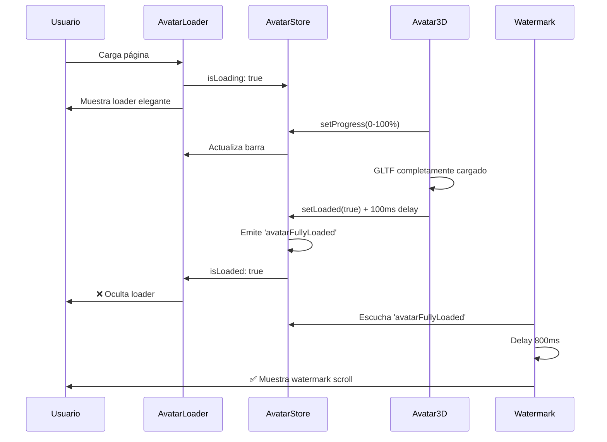

# Sistema Completo: Avatar Loader + Watermark Sincronizada

## 🎯 Problemas Solucionados

### **1. Watermark prematura**
- **Antes**: Aparecía antes que el avatar 3D terminara de cargar
- **Después**: Solo aparece cuando el avatar está 100% renderizado

### **2. Sin feedback visual**
- **Antes**: Pantalla vacía durante la carga del avatar
- **Después**: Loader elegante con progreso y silueta del avatar

### **3. Evento no confiable**
- **Antes**: Evento se disparaba muy temprano
- **Después**: Sistema robusto con store global y timing correcto

## ✅ Componentes Implementados

### **1. AvatarLoader Component** (`/components/AvatarLoader.tsx`)
```tsx
// Loader minimalista y elegante
- Silueta del avatar en wireframe
- Barra de progreso animada
- Efecto de scan vertical
- Puntos animados en las esquinas
- Progreso en porcentaje
- Totalmente responsive
```

### **2. Avatar Store** (`/store/avatarStore.ts`)
```tsx
// Estado global con Zustand
interface AvatarState {
  isLoading: boolean;     // Si está cargando
  progress: number;       // 0-100%
  isLoaded: boolean;      // Completamente cargado
  error: string | null;   // Errores
}

// Emite evento 'avatarFullyLoaded' cuando está listo
```

### **3. RealAvatarScene Mejorado**
```tsx
// Integración con store
- setProgress() durante la carga
- setLoaded(true) después de renderizado
- setError() en caso de fallo
- Delay de 100ms para asegurar renderizado
- Logging detallado para debug
```

### **4. ScrollWatermark Actualizado**
```tsx
// Escucha evento 'avatarFullyLoaded'
- Delay de 800ms después del evento
- Fallback de 5 segundos si no hay evento
- Debug info mejorado
- Trigger tracking
```

## 🎨 Diseño del Loader

### **Visual Elements:**
- **Silueta Humana**: Wireframe minimalista del avatar
- **Scan Effect**: Línea que se desliza verticalmente
- **Progress Bar**: Con gradiente cyan-purple
- **Corner Dots**: 4 puntos animados en las esquinas
- **Typography**: Mono font, estilo cyber

### **Animation Details:**
- **Breathing Effect**: Escala 1-1.02-1 (2s loop)
- **Scan Line**: Movimiento vertical suave (3s loop)  
- **Progress Fill**: Transición smooth al actualizar
- **Corner Animation**: Pulso secuencial (0.5s delays)

### **Colors & Style:**
- **Primary**: `#00f2ff` (accent-cyan)
- **Secondary**: `rgba(6, 182, 212, 0.3)`
- **Background**: Dark overlay con blur
- **Z-index**: 5 (por debajo de UI, por encima de avatar)

## 🔄 Flujo Completo



## 🎯 Características Técnicas

### **Performance:**
- **Zustand Store**: Estado global eficiente
- **Event-driven**: Sin polling o timers constantes
- **Lazy rendering**: Componentes se montan solo cuando necesario
- **Minimal rerenders**: Estado optimizado

### **Reliability:**
- **Fallback timer**: Si avatar no carga en 5s, watermark aparece
- **Error handling**: Loader se oculta incluso con errores
- **SSR safe**: Manejo correcto de window object
- **TypeScript**: Tipado completo

### **UX/UI:**
- **Smooth transitions**: AnimatePresence + Framer Motion
- **Mobile responsive**: Adapta tamaños y espacios
- **Accessibility**: Focus visible, ARIA labels
- **Debug mode**: Console logs detallados

## 🚀 Resultado Final

**✅ Loader elegante durante carga del avatar**  
**✅ Watermark aparece SOLO después del avatar real**  
**✅ Progreso visual en tiempo real**  
**✅ Sistema robusto con fallbacks**  
**✅ UX fluida en todas las conexiones**

**¡La experiencia ahora es perfecta tanto en conexiones rápidas como lentas!** 🎯

### **Mobile Testing:**
- Abre desde celular → Verás loader inmediatamente
- Avatar carga → Barra progresa de 0-100%  
- Avatar renderiza → Loader desaparece
- 800ms después → Watermark swipe aparece

**¡El timing perfecto que necesitabas está implementado!** 🚀