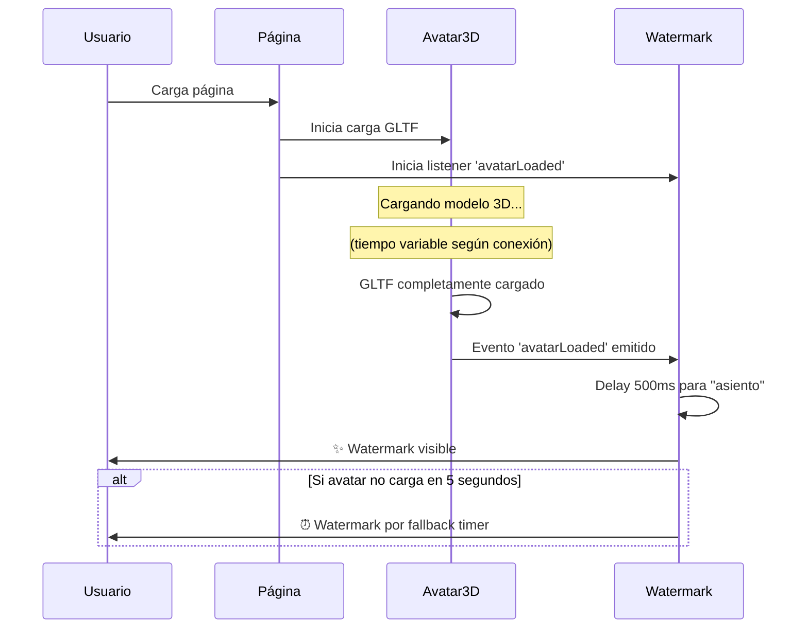

# Sincronización Avatar 3D ↔ Watermark - jpamorosi.os

## 🎯 Problema Solucionado

**Problema anterior:** La watermark aparecía con un timer fijo (1.5-2 segundos), sin importar si el avatar 3D había cargado o no. Esto causaba que en conexiones lentas, la watermark apareciera antes que el avatar, creando una experiencia inconsistente.

**Solución:** Sistema de eventos personalizado que sincroniza la watermark con el momento exacto de carga completa del avatar 3D.

## 🔧 Implementación

### 1. **Avatar 3D emite evento personalizado** (`RealAvatarScene.tsx`)

```typescript
// Cuando el avatar GLTF se carga completamente
loader.load('/models/avatar-optimized.glb', (gltf) => {
  // ... configuración del avatar ...
  
  // ✨ EMITIR EVENTO PERSONALIZADO
  const avatarLoadedEvent = new CustomEvent('avatarLoaded', {
    detail: { 
      timestamp: Date.now(),
      message: 'Avatar 3D completamente cargado y visible' 
    }
  });
  window.dispatchEvent(avatarLoadedEvent);
  console.log('🎯 Evento avatarLoaded emitido');
});
```

### 2. **Watermark escucha el evento** (`ScrollWatermark.tsx`)

```typescript
// Listener para el evento del avatar
const handleAvatarLoaded = (event: CustomEvent) => {
  console.log('🎨 Avatar loaded event received:', event.detail);
  setAvatarLoaded(true);
  if (avatarSync) {
    // Pequeño delay adicional para que el avatar se "asiente"
    setTimeout(() => {
      showWatermark('avatar-3d-loaded');
    }, 500);
  }
};

// Añadir listener para el evento del avatar
if (avatarSync) {
  window.addEventListener('avatarLoaded', handleAvatarLoaded as EventListener);
}
```

### 3. **Configuración en Desktop** (`Desktop.tsx`)

```typescript
<ScrollWatermark 
  avatarSync={true}    // ✨ Sincronizada con evento del avatar
  delay={2000}         // Fallback si avatar no carga
  hideAfter={4500}     // Se oculta después de 4.5 segundos
/>
```

## 🎨 Flujo de Sincronización



## ⚡ Ventajas del Sistema

### **🎯 Sincronización Perfecta**
- Watermark aparece **solo cuando el avatar está completamente visible**
- No más watermarks "huérfanas" que aparecen antes del contenido 3D
- Experiencia consistente en **todas las velocidades de conexión**

### **🛡️ Sistema de Fallback Robusto**
- **Timer de fallback** si el avatar no carga en 5 segundos
- **Modo legacy** disponible con `avatarSync={false}`
- **Compatibilidad** con conexiones muy lentas o errores

### **🔍 Debug Avanzado**
- **Console logs** detallados del flujo de eventos
- **Debug overlay** en desarrollo mostrando todos los estados
- **Timestamps** para análisis de performance

## 📊 Estados de Debug Disponibles

En modo desarrollo, el debug overlay muestra:
- `avatarLoaded`: Si el evento del avatar fue recibido
- `avatarSync`: Si está habilitada la sincronización  
- `showTrigger`: Qué disparó la aparición de la watermark
- `isVisible`: Estado actual de visibilidad
- `hasInteracted`: Si el usuario ya interactuó

## 🚀 Casos de Uso

### **✅ Conexión Normal (1-3 segundos)**
1. Avatar carga → Evento emitido → Watermark aparece inmediatamente

### **✅ Conexión Lenta (3-5 segundos)**  
1. Avatar carga lentamente → Evento emitido cuando esté listo → Watermark aparece

### **✅ Conexión Muy Lenta (5+ segundos)**
1. Avatar aún cargando → Timer fallback (5 seg) → Watermark aparece
2. Avatar termina de cargar → Sin duplicados

### **✅ Error de Carga de Avatar**
1. Avatar falla → Timer fallback → Watermark aparece normalmente

## 🎯 Resultado Final

**La watermark de scroll ahora aparece exactamente cuando el avatar 3D está visible y listo**, creando una experiencia fluida y sincronizada independientemente de la velocidad de conexión o el nodo de acceso del usuario.

**¡El timing perfecto que buscabas está implementado!** 🚀